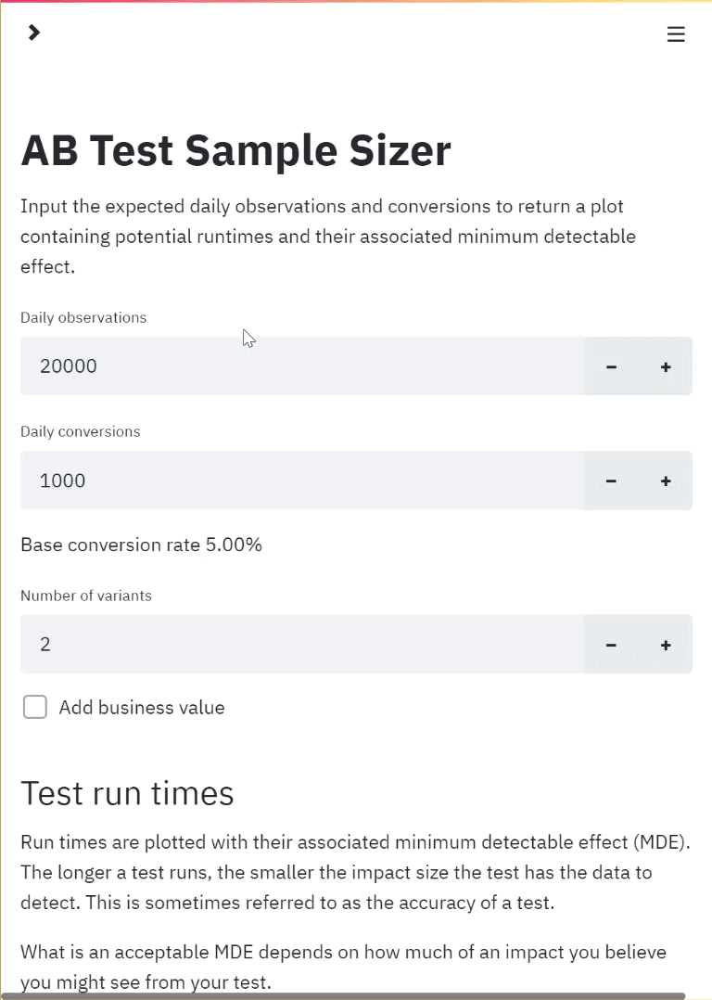

# AB test sample size calculator

An AB test sample size calculator. Calculations come through basic SciPy.stats methods, the web app is built with Streamlit and hosted on Heroku. See it live [here](https://abtestsamplesize.herokuapp.com/).

<p align="center">
  
</p>

## Table of Contents

- [Getting Started](#getting-started)
- [Deployment](#deployment)
- [Built With](#built-with)
- [Features](#features)
- [License](#license)

## Getting Started

These instructions will get you a copy of the project up and running on your local machine for development and testing purposes. See deployment for notes on how to deploy the project on a live system.

## Installing

### Clone Repository

Clone/fork the repo onto your local machine.

It is then recommended to use a virtual environment to install the dependencies using the requirements.txt file.

```cli
pip install -r requirements.txt
```

With these installed, you simply need to run

```cli
streamlit run app.py
```

### Docker

Alternatively, with Docker, use the following command and then navigate to localhost.

```
docker run -dp 80:8080 ryanfox212/samplesize
```

## Deployment

I utilised Heroku's free tier to host the web app. To do the same, create a project on Heroku's website and then I recommend linking the project to a Github repository in the Deploy section.

Alternatively, you can use the [Heroku CLI](https://devcenter.heroku.com/articles/heroku-cli). Provided you have already created a project on the site, use

```cli
heroku git:remote -a [project-name]
git push heroku master
```

Use the same project name as the one you created. If successful, you can then go to `https://[project-name].herokuapp.com/`.

## Built With

- [Streamlit](https://www.streamlit.io/) - The web application framework used
- [SciPy](https://www.scipy.org/) - For the statistical methods
- [Seaborn](https://seaborn.pydata.org/) - For vizualisations
- [Heroku](https://heroku.com/) - Cloud platform used for deployment

## Features

### Minimal inputs

The calculator asks for daily observations and conversions and the number of variants that you would like to test.

Optional inputs:

- business value
- significance level (1-alpha)
- statistical power
- maximum runtime

### Useful output

A notable exception from the possible inputs is minimum detectable effect that you hope to achieve through the change made. Instead, this sample size calculator outputs a range of MDEs based on how long you run the test.

Personally, I have found this form of output more useful when scoping out tests to understand the level of precision that might be achieved.

The number of visitors I need in my test to achieve the required sample by itself does not tell me very much. It is this number relative to my traffic levels that gives me the information I need.

### Understanding business impact

Adding the business value of a conversion helps to understand what is the potential benefit/risk behind the change.

## License

This project is licensed under the MIT License - see the [LICENSE](LICENSE) file for details.

- Powered by Python
- Built with Streamlit
- Hosted on Heroku

Suitable for binomial metrics only, i.e. metrics with binary outcomes such as conversion rate.
